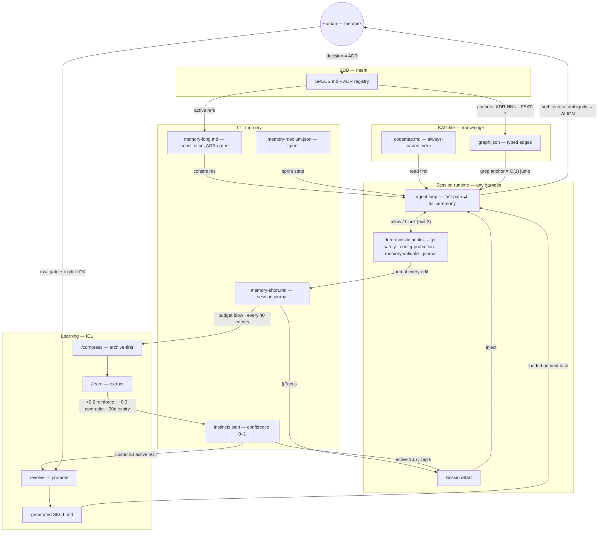

# ⚔️ Berserqir

**The agent legion harness.** Spec-driven development + hierarchical memory + an agentic loop with human alignment gates + behavioral evals — installed into your repo as a disciplined squad of AI agents, portable across GitHub Copilot, Claude Code and Cursor.

```bash
cd your-repo
npx berserqir install                        # detects your IDE + repo signals, proposes harness & areas
npx berserqir install --harness claude-code  # or pick explicitly: copilot | claude-code | cursor
# then, in your harness chat:
/init                                        # interview (greenfield) or codebase scan (brownfield)
```

> *Berserqir* — Old Norse plural of *berserkr*: a legion of bear-warriors under one command.

## What you get

- **18 agents in a real hierarchy** — orchestrator, architect, product, senior/mid/junior squads per area, plus read-only QA and security gates. Juniors fast-path trivial work; anything touching auth, payments, migrations or IAM escalates. Panels of 3 deliberate genuine alternatives; humans decide architecture.
- **36 discipline skills, zero framework lock-in** — API design, data safety, observability, async jobs, caching, design patterns, system design, anti-slop UI, accessibility, SEO, networking (BGP/OSPF), DR/HA, GitOps, containers, Kubernetes, incident response, FinOps and more. Your stack's idioms come from **your project memory**, not from the package.
- **Hierarchical memory with TTLs** — `memory-long.md` (constitution) · `memory-medium.json` (sprint tracker) · `memory-short.md` (session journal, hook-appended) · `codemap.md` + `graph.json` (textual repo graph: grep an anchor like `ADR-012` and it resolves — no embeddings, no database; see *Context is a knowledge graph* below).
- **Guardrail hooks (deterministic, zero-LLM)** — git-safety (no push/force/reset without a human), secret-scan, config-protection ("fix the code, not the ruler"), memory validation, commit quality.
- **14 behavioral evals with anti-checks** — including the ones that catch over-ceremony, not just under-performance. `/run-evals` smoke-tests your installed harness.
- **Project-truth artifacts** — `DESIGN.md` (front installs): your visual system — tokens (Name ≠ Value), type scale, component inventory, project bans — seeded by `/init`, budget-capped at 3k tokens by hook. **MCP map**: `/init` scans your configured MCP servers (`.mcp.json` · `.cursor/mcp.json` · `.vscode/mcp.json`), you confirm purpose per server, and the orchestrator routes with them in mind — never referencing unmapped tools.
- **Update nudges, zero friction** — hooks check npm at most once a day (detached, offline-safe) and nudge when a new version ships; Claude Code injects it at session start. Opt out with `BERSERQIR_NO_UPDATE_CHECK=1`.
- **Commands** — `/berserqir init | compress | learn | evolve | evals | review | checkpoint | status`, plus `npx berserqir doctor` for a deterministic health score of the installation itself. `/learn` extracts **instincts** (project-specific patterns, confidence-scored, evidence-backed) from the session journal; `/evolve` clusters mature instincts into generated skills — eval-gated and human-approved.

## How it works

Canonical sources (`core/` protocols + `profiles/` per area) are **compiled** into your harness's native format at install time — agents materialize complete, the knowledge hub lands in `.berserqir/`. Everything is vendored: no runtime dependency on npm, works in a Terraform-only repo without a `package.json`.

### CLI overview (`npx berserqir …`)

| Command | What it does |
|---|---|
| `install` | Compiles + installs. Detects your **IDE terminal + repo signals** for the harness and your **stack** for the areas, proposes, asks before writing |
| `update` | Recompiles with the new version. Remembers harness & areas from the manifest; **never silently overwrites files you edited**; prunes orphans from old versions |
| `uninstall` | Removes managed, untouched files after confirmation. **Your memory and PRD/SPECS/TESTS always survive** |
| `doctor` | Deterministic health score — wiring, guardrails, memory budgets, graph integrity, update check. Exit 1 on critical failure (CI-safe) |
| `version` · `help` | What you'd expect |

| Flag | Meaning |
|---|---|
| `--harness <name>` | Compile target: `copilot` \| `claude-code` \| `cursor`. Omitted → IDE terminal detection → repo signals → asks |
| `--profiles <list>` | Squads: `front,back,ops,infra` · `full` = everything · `core` = invariant only. Omitted → stack detection → asks |
| `--dir <path>` | Target repo (default: current directory) |
| `--yes` / `-y` | Accept detected defaults, skip confirmations (scripts/CI) |
| `--force` | Overwrite files you modified since the last install |
| `--dry-run` | Print the plan, write nothing |

`--harness` and `--profiles` are **orthogonal axes** — format × content — and combine freely:

```bash
npx berserqir install --harness claude-code --profiles back,infra --yes
```

### In-chat commands (inside your harness)

| Command | What it does |
|---|---|
| `/berserqir init` | Bootstrap — greenfield interview or brownfield scan with block-by-block confirmation |
| `/berserqir compress` | Archive-first memory compression at logical breakpoints |
| `/berserqir learn` | Extract instincts (confidence-scored project patterns) from the session journal |
| `/berserqir evolve` | Cluster mature instincts into a generated skill — eval-gated, needs your OK |
| `/berserqir evals [id]` | Run the behavioral suite (pass@3, anti-checks included) |
| `/berserqir review` | Read-only code review by the QA gate — reports, never fixes |
| `/berserqir checkpoint` | Manual memory-sync + suggested conventional commit (nothing pushed) |
| `/berserqir status` | Harness state report + one recommended next action |

Updates are hash-aware: files you modified are kept unless you `--force`. Your model roster (set during `/init`) survives updates and drives recompilation.

## Context is a knowledge graph (KAG, the lite way)

Berserqir's context layer is a deliberate lightweight take on **KAG — Knowledge Augmented Generation**: retrieval routed through a knowledge graph instead of similarity search over document chunks (RAG). Each heavy KAG component has a deterministic, zero-infrastructure equivalent:

| KAG pillar | Berserqir equivalent |
|---|---|
| LLM-friendly knowledge representation | Typed graph — nodes `file/module/adr/feature/debt`, edges `implements/depends/supersedes` (`graph.json` + JSON schema) |
| Mutual indexing (graph ↔ source text) | Canonical anchors (`ADR-012`, `FEAT-2026-…`, `DEBT-007`) exist in the graph **and** in specs, memory and commit messages — `grep` resolves them both ways, O(1) |
| Guided reasoning (logical-form solver) | Agentic traversal — read `codemap.md` (always-loaded index, ≤2k tokens), follow edges, grep the anchor. The LLM is the planner; multi-hop = walking `depends`/`supersedes` |
| Knowledge alignment | Deterministic — memory-sync ritual + validation hooks + eval `e11` (ghost nodes, dangling anchors, silent graph rot) |

The trick that makes "lite" viable: **canonical IDs design away entity linking and disambiguation** — the most expensive parts of full KAG. No embeddings, no vector store, no extraction pipeline. `/init` builds the graph (human-confirmed, block by block, on brownfield), the memory-sync ritual keeps it alive, and `e11` fails loudly when it rots.

## Architecture (the technical part)

**Terminology, precisely:** GitHub Copilot, Claude Code and Cursor are the *harnesses* — the runtimes that wrap a model with tools. Berserqir is the **discipline layer compiled into them**: one canonical source, three native materializations. Same squad, same memory, same guardrails — whichever harness each dev on your team runs.

### Why SDD ⊕ ICL ⊕ KAG (the design rationale)

Agent failures in real codebases are predictable. Each pillar answers exactly one failure mode:

| Failure mode | Pillar | What it provides |
|---|---|---|
| **Drift** — agents re-decide things already decided, invent requirements, ship past the spec | **SDD** (spec-driven development): the PRD → SPECS → TESTS triangle + ADR registry as a governance hierarchy with defined precedence. Architectural ambiguity doesn't get guessed — it **blocks** and routes to the human (ALIGN gate), and the decision lands as an ADR | *Authority* — what to build and who decides, in writing |
| **Amnesia** — every session starts from zero; you make the same correction five times; advice stays generic | **ICL** (in-context learning): a curated demo pool (1–2 task-matched examples, anti-examples from real failures, provenance tracked) + the instinct pipeline that grows demos and skills from your session journal. Fine-tuning per repo is impossible — **the context window is the only learning channel that exists at the model boundary**, so it has to be engineered, not improvised | *Learning* — how THIS project does things |
| **Drowning** — the repo exceeds the context window; vector RAG is weak at multi-hop code relations and decision trails | **KAG-lite** (previous section): typed graph + canonical anchors + agentic grep traversal, zero infrastructure | *Navigation* — where things are, how they connect, and why |

The pillars don't stand alone — they close a loop through the memory system: **SDD mints the anchors** (`ADR-012`, `FEAT-…`) → **the graph indexes them** (KAG's mutual indexing) → **agents traverse cheaply** and the journal records what happened → **the instinct pipeline turns the journal into behavior** (ICL demos, generated skills) → promoted decisions feed back into SPECS and memory-long. Intent, knowledge and behavior form a cycle; the TTL memory tiers (long/medium/short) are the substrate that carries it between sessions.

### The loop, visualized (memory × runtime)



Every arrow is either a deterministic hook (zero-LLM) or a gated prompt workflow — nothing in the loop relies on the model "remembering to do it".

### Why core ⊕ profiles ⊕ adapters (one source, many targets)

The decomposition follows **what varies**: discipline is invariant (the loop, report schema, guardrails, evals — `core/`), content varies by area (front/back/infra/ops overlays, instructions and skills — `profiles/`), format varies by harness (`adapters/`). Nothing is duplicated along an axis it doesn't vary on: edit one protocol → recompile → all 18 agents update in every harness. And the stack appears in **none** of it — your stack and conventions live in project memory (`memory-long §stack`, seeded by `/init`), which is why the same package serves a component-heavy web app and a Terraform-only infra repo without shipping a single framework name.

### Canonical monorepo

```
core/        the invariant — always installed
  agents/      8 archetypes: orchestrator · architect · product · senior · pleno · junior · qa · security
  protocols/   agentic-loop · memory-sync · deliberation · parallelism · context-budget · mentorship · instincts · sub-agent-report
  skills/      5 core disciplines · hooks/  6 zero-dep guardrails · evals/  e01–e13 (each with an anti-check)
  memory/      templates + JSON schemas (TTL tiers, graph, instincts) · prompts/  the workflows · templates/  SDD skeletons
profiles/    per-area content — install what you need
  front/ back/ infra/ ops/{dev,sec,fin,ia}   (agent overlays · glob-scoped instructions · 31 discipline skills)
adapters/    one compiler per harness (copilot · claude-code · cursor) — zero dependencies
installer/   the npx CLI: install · update · uninstall · doctor — zero dependencies
```

### The compilation model

Agents ship as **archetype ⊕ overlay**: `core/agents/senior.md` (loop discipline, report schema, context budgets, escalation rules) composed with `profiles/front/agents/sr-front.md` (skills, scope, handoffs) → one complete agent materialized per harness. Overlay wins on conflict; `never` scopes union; generic tier references (senior/pleno/junior) are rewritten to the installed area squad, so the orchestrator always routes to real agents.

Each adapter enforces its target's **frontmatter whitelist** (`core/FORMAT.md`). Anything a harness doesn't support is *never dropped* — it renders as body sections the model still reads. Degradation is explicit:

| Capability | Copilot | Claude Code | Cursor |
|---|---|---|---|
| Agents | `.github/agents/` + native handoffs | `.claude/agents/` | `.cursor/agents/bq-*` (prefixed) |
| Glob-scoped instructions | native `applyTo` | table in CLAUDE.md (agent discipline) | native `.mdc` rules |
| Commands | `.github/prompts/` | `.claude/commands/` | `.cursor/commands/` |
| Guardrail hooks | postToolUse JSON | **full native**: PreToolUse deny · SessionStart inject · Stop verify · PreCompact archive | `hooks.json` permission protocol (real deny) |
| Model routing | roster names | `opus/sonnet/haiku` aliases | Auto (roster optional) |

### Load regimes (hub-and-spoke)

Harnesses auto-load by path, so placement follows the **load regime**, not DRY dogma: always-loaded content (agents, rules, bootstrap) is materialized inside each harness dir — a pointer would degrade it; on-demand content (protocols, templates, evals, skill resources) lives once in the `.berserqir/` hub, referenced by relative path; shared state (PRD/SPECS/TESTS, memory, graph) sits at the root/hub — a mixed team (one dev on Cursor, another on Claude Code) reads the same truth.

### Two-layer automation

**Hooks detect, agents think.** The deterministic layer (zero-LLM scripts) journals every edit, validates memory schemas and budgets, blocks dangerous git, and flags compress/evolve readiness at the exact right moment. The semantic layer (prompts + the memory-sync ritual) does the thinking: triage, extraction, drafting. The human ALIGN gate on skill promotion is never automated away.

### Role taxonomy & routing

Three role types with hard tool discipline: **authority** (orchestrator — architecturally cannot edit; architect; product), **execution** (senior/pleno/junior per area — junior is the cheap fast-path lane and always escalates on auth, payments, migrations), **gate** (qa, security — read-only). `model: top|mid|fast` resolves per harness and plan via `models.json` (seeded by `/init` question 8, survives updates). Parallel wave cap = deliberation quorum = **3**.

### The control plane (delegation · escalation · deliberation · mentorship)

- **Delegation is contract-first** — every sub-agent returns a Sub-Agent Report (JSON schema: status, files touched, verification evidence, `memorySync`). No valid report, no accepted work — the orchestrator validates instead of trusting.
- **Escalation ladder** — junior → pleno → senior → architect → orchestrator, and **domain beats size**: a one-line diff in auth/payments/migrations escalates; a 200-line rename doesn't.
- **Deliberation quorum = 3** — trivial gets one agent; genuine technical alternatives get a 3-vote panel; architectural questions get a proponent × opponent × synthesizer debate whose output is *advisory* — the human ratifies via ALIGN and the decision lands as an ADR. Odd panels can't tie.
- **Ceremony auto-regulates** — the fast-path skips phases by rule, not by mood, and the eval suite anti-checks *over*-ceremony as hard as under-performance.
- **Mentorship (anti-deskilling)** — per-area modes from `human-profile.md`: Learn (teach before doing), React (accelerate the known, teach the new), Productivity (full multiplier). Dual calibration: the project shapes generated content, the human profile shapes its depth. Guardrails are identical in every mode.

In classic terms: adapters are the literal **Adapter** pattern · archetype ⊕ overlay is **template-method inheritance flattened at compile time** · model routing is a **strategy table** · guardrails are **policy-as-code** · the hub is a **single source of truth with materialized views**.

### Install semantics

Everything is **vendored** — npm exists only at install/update time; the harness runs in a Terraform-only repo with no `package.json`. `.berserqir/manifest.json` records hashes of the *compiled* artifacts: disk ≠ hash means you modified the file, and `update` never overwrites it silently (orphans from old versions are pruned; your memory is always preserved). `doctor` scores the installation deterministically — wiring, guardrails, memory budgets, graph integrity — and is CI-safe (exit 1 on critical failure).

## Philosophy

1. **Discipline over templates** — skills teach the universal rules (the *why*); your codebase's conventions live in memory, seeded by `/init` and refined as the harness learns your project.
2. **The human is the apex** — architectural decisions go through ALIGN gates and land as ADRs. Guardrails never relax, not even mid-incident.
3. **Everything is testable** — every behavior has an eval, every eval has an anti-check, every guardrail has a human override that gets logged.

## Status

`0.3.x` — all three MVP targets complete: **GitHub Copilot**, **Claude Code** (`--harness claude-code` — native session hooks: automatic memory injection, instinct loading, archive-before-compaction, git-safety as PreToolUse) and **Cursor** (`--harness cursor` — glob-scoped area rules, `bq-*` agents, git-safety denies via the hooks permission protocol). MIT.
